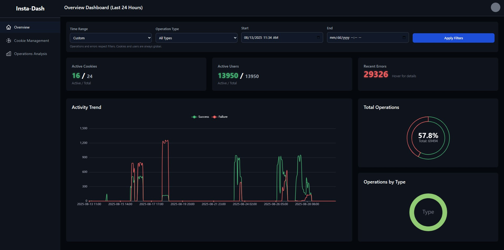
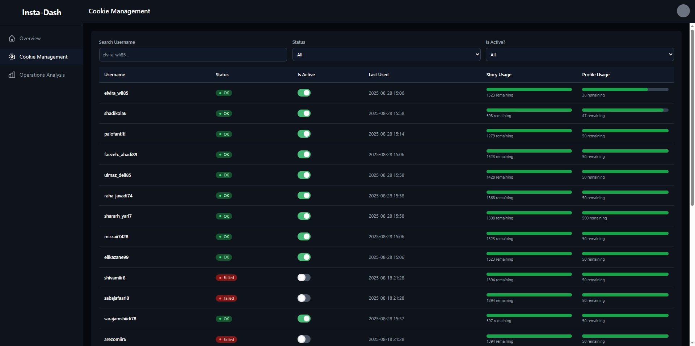
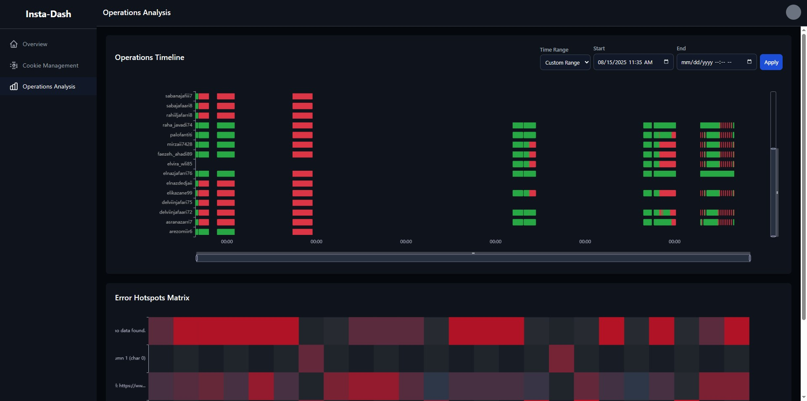

# Django & MongoDB Dashboard for Instagram Project

This repository contains a high-performance administrative dashboard built with **Django** and connected to a **MongoDB** database. It is designed to monitor, organize, and analyze data collected from Instagram-related operations. The primary goal is to provide a centralized, fast, and efficient interface for viewing critical operational data, such as session cookies, server responses, and other collected metrics.

## 🖼️ Dashboard Preview Gallery

Here are a few screenshots showcasing different views of the dashboard:

<table align="center">
  <tr>
    <td align="center"><strong>Main & Overview</strong></td>
    <td align="center"><strong>Data Table View</strong></td>
    <td align="center"><strong>Detailed Record View</strong></td>
  </tr>
  <tr>
    <td></td>
    <td></td>
    <td></td>
  </tr>
</table>

## 🚀 Key Features

-   **Optimized MongoDB Integration:** Directly reads from a NoSQL MongoDB database, ensuring fast, real-time data retrieval and display, ideal for handling large volumes of data.
-   **Centralized Data Management:** Provides a single source of truth for all operational data, making it easy to track and organize information without querying the database manually.
-   **Advanced Search & Filtering:** Implements powerful search and filtering capabilities, allowing users to quickly isolate and analyze specific data points.
-   **Secure & Scalable Backend:** Leverages the robust Django framework for security, authentication, and a modular architecture that is easy to scale and maintain.
-   **Responsive User Interface:** The front-end is designed to be fully responsive, providing a seamless experience on desktops, tablets, and mobile devices.

## 🛠️ Tech Stack

-   **Backend:** Django
-   **Database:** MongoDB
-   **Database Connector:** Djongo (or specify the Python driver you used, e.g., PyMongo)
-   **Frontend:** HTML, CSS, JavaScript *(Feel free to add libraries like Bootstrap, Chart.js, etc.)*

## 🤝 Contributing

Contributions, issues, and feature requests are welcome. Feel free to check the [issues page](https://github.com/YOUR_USERNAME/Dashboard-InstagramProject/issues) if you want to contribute.

## 📜 License

This project is licensed under the MIT License. See the [LICENSE](LICENSE) file for details.

---
_**Disclaimer:** This project is intended for educational and analytical purposes for data you are authorized to access. It is not affiliated with, authorized, endorsed by, or in any way officially connected with Instagram or any of its subsidiaries or its affiliates._
